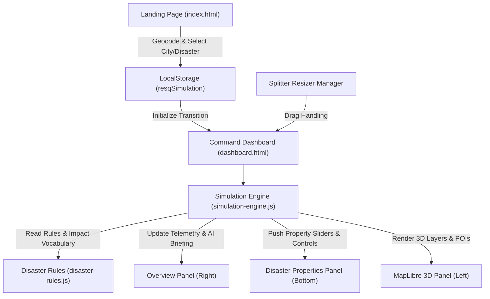

# RESQ — System Architecture Document

## 1. High-Level Architectural Flow



---

## 2. Component Layers

### 2.1 Presentation Layer (`dashboard.html`, `dashboard.css`)
- **Navbar**: Top persistent HUD containing branding, active scenario chip (`{City}, {Country} • {Disaster}`), play/pause controls, speed accelerator, scenario reset, theme toggle, and exit navigation.
- **Left Panel (Map)**: MapLibre GL 3D perspective viewport at 45° pitch, 3D extruded buildings, layer control chips, and floating telemetry overlays.
- **Right Panel (Overview)**: Real-time animated counters with severity color codings, plus the dynamic dual-section AI Situation Briefing and Actionable Evacuation Guidance.
- **Bottom Panel (Disaster Properties)**: Multi-parameter telemetry monitors and interactive scenario sliders matching the active disaster model.
- **Splitters (`.resizer-v`, `.resizer-h`)**: Draggable handles coordinating fluid flex/grid panel sizing on desktop.

### 2.2 Domain & Simulation Layer (`simulation-engine.js`, `data/disaster-rules.js`)
- **`disaster-rules.js`**: Pure data definitions containing city classifications, compatibility matrices, baseline metric curves, and asset/transit damage models.
- **`simulation-engine.js`**: Reactive simulation state manager holding `simulationState`:
  - `elapsedTime`, `severity`, `paused`, `speed`
  - `properties`: Live disaster parameter values
  - `metrics`: Real-time counts (affected pop, hospital load, blocked roads, shelters, outages)
  - `aiResponse`: Generated situation report and route advice
  - Subscriptions: Pub-Sub event dispatch triggering UI and map re-renders on state tick.

### 2.3 Map Visualization Engine (`dashboard.js`)
- MapLibre GL JS integration using free, keyless vector tiles (OpenFreeMap / CARTO).
- 45° camera pitch, street-level zoom, 3D building extrusions.
- Procedural GeoJSON layers:
  - **Blocked Roads**: Solid red line layer (`#ef4444`, `width: 4px`).
  - **Evacuation Routes**: Solid green line layer (`#10b981`, `width: 4px`, dashed/glow).
  - **Hazard Zone**: Translucent yellow polygon (`rgba(245, 158, 11, 0.22)`).
  - **POIs**: Custom DOM markers for Shelters, Available/Full Hospitals, and Power Grid Outages.
- Interactive popups displaying real-time asset telemetry on hover or click.

---

## 3. Directory & File Structure
```
/
├── index.html              # Landing page (Phase 1 locked reference)
├── style.css               # Landing page stylesheet (Phase 1 locked reference)
├── script.js               # Landing page logic (extended with coastal constraint)
├── dashboard.html          # Command dashboard entry point
├── dashboard.css           # Command dashboard styles & design tokens
├── dashboard.js            # Dashboard UI orchestration & map engine
├── simulation-engine.js    # Simulation loop & dynamic AI generator
├── data/
│   └── disaster-rules.js   # Disaster parameters, rules, and impact vocabulary
├── memory.md               # Operational resume point & build log
├── Project_Requirements.md # Master requirements
├── Architecture.md         # System architecture & data flow
├── Rules.md                # Stack and quality constraints
├── Phases.md               # Phased roadmap & milestones
└── Design.md               # Design system & visual specifications
```
